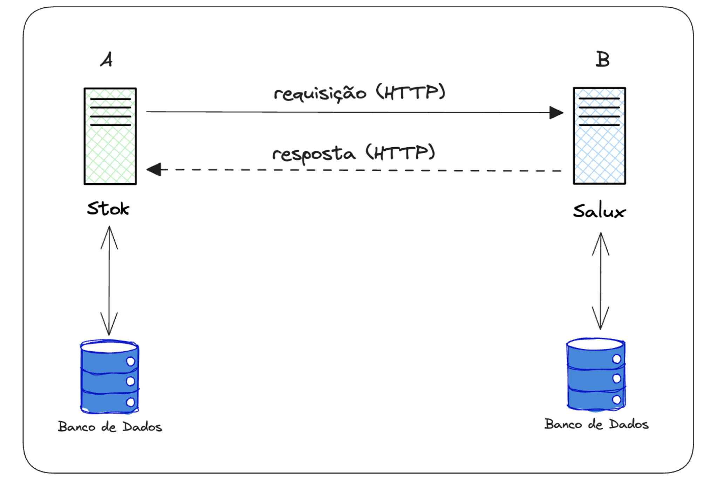

# Vantagens na Utilização de um Broker de Mensageria

O uso de um broker de mensageria, como o RabbitMQ, oferece uma arquitetura de comunicação assíncrona e indireta que melhora a **resiliência**, **escalabilidade** e **simplificação** da integração entre sistemas. Ele também reduz a dependência da disponibilidade imediata de todos os sistemas envolvidos, garantindo maior robustez e eficiência no processamento de mensagens em ambientes distribuídos.

## Comunicação Tradicional (API REST)

Em uma integração tradicional via **API REST**, a comunicação entre sistemas ocorre de forma **síncrona** e direta:

- O **Sistema A** faz uma requisição diretamente ao **Sistema B** e aguarda uma resposta imediata.
- A comunicação depende da disponibilidade de ambos os sistemas no momento da requisição.
- Se o **Sistema B** estiver indisponível, o **Sistema A** receberá um erro e a comunicação falhará.

### Problemas Comuns na Comunicação via API REST:
- **Dependência de Disponibilidade**: Se o **Sistema B** estiver fora do ar, a requisição do **Sistema A** falha.
- **Escalabilidade**: Se o número de requisições enviadas pelo **Sistema A** exceder a capacidade do **Sistema B**, o sistema de destino pode ficar sobrecarregado, resultando em falhas.
- **Acúmulo de Requisições**: Como o protocolo HTTP, utilizado em REST, é síncrono, as requisições se acumulam se o **Sistema B** não puder responder rapidamente, esgotando recursos como threads e conexões, o que pode causar interrupções no serviço.

## Comunicação com RabbitMQ

Ao utilizar um broker de mensageria como o **RabbitMQ**, a comunicação entre sistemas torna-se **assíncrona** e indireta:

- O **Sistema A** não precisa esperar que o **Sistema B** esteja disponível para receber sua mensagem.
- A mensagem é enviada ao **broker** (RabbitMQ), que atua como um intermediário.
- O broker garante que a mensagem seja entregue ao **Sistema B** assim que este estiver disponível.

### Vantagens da Utilização de um Broker como RabbitMQ:

#### 1. **Balanceamento de Carga**
O RabbitMQ distribui as mensagens entre múltiplas instâncias do **Sistema B**, se necessário. Isso ajuda a evitar sobrecarga e melhora a escalabilidade da solução.

#### 2. **Mecanismos de Retry e Dead-letter Queues (DLQ)**
Caso o **Sistema B** não consiga processar uma mensagem, o RabbitMQ pode reencaminhá-la automaticamente após um período de tempo ou movê-la para uma **Dead-letter Queue (DLQ)**, onde pode ser tratada posteriormente. Isso garante que falhas temporárias não resultem em perda de dados.

#### 3. **Persistência de Mensagens**
As mensagens podem ser persistidas no RabbitMQ, garantindo que não sejam perdidas, mesmo que o broker ou o sistema destinatário enfrentem interrupções. Quando o **Sistema B** se torna disponível novamente, ele pode consumir todas as mensagens pendentes na fila.

#### 4. **Redução da Necessidade de Integração Ponto a Ponto**
Utilizando um broker de mensageria, como o RabbitMQ, eliminamos a necessidade de criar integrações diretas e específicas entre cada par de sistemas. Em vez disso, os sistemas se conectam ao broker, que atua como um ponto central de comunicação.

Este padrão é conhecido como **Message Broker** no **Enterprise Integration Patterns (EIP)**, onde o broker gerencia a distribuição de mensagens entre os sistemas, reduzindo a complexidade e o acoplamento entre os componentes da arquitetura.

---

Com o RabbitMQ, a comunicação entre sistemas se torna mais robusta, escalável e eficiente, facilitando o gerenciamento de mensagens em um ambiente distribuído.

# Links úteis

<!-- - [Configuração de RabbitMq para Integração Magaluloja1 e CDD](https://docs.google.com/document/d/1JKm4dPuiFgWFzKHqMx9Ktz1xPgJiDWZvsWIHbH9YJ1o/edit)
- [Backup & Recovery](https://docs.google.com/document/d/1lj9-vjQ4paj81duMIEZKNLXP-z1lP79wPnrwcqn4o_8/edit)
- [Integração entre Sistemas Magaluloja1 & CDD](https://docs.google.com/document/d/18me7ihI1JJLujFu7gYobWiSs4bZMqUwU2nFY7IqOmkI/edit) -->